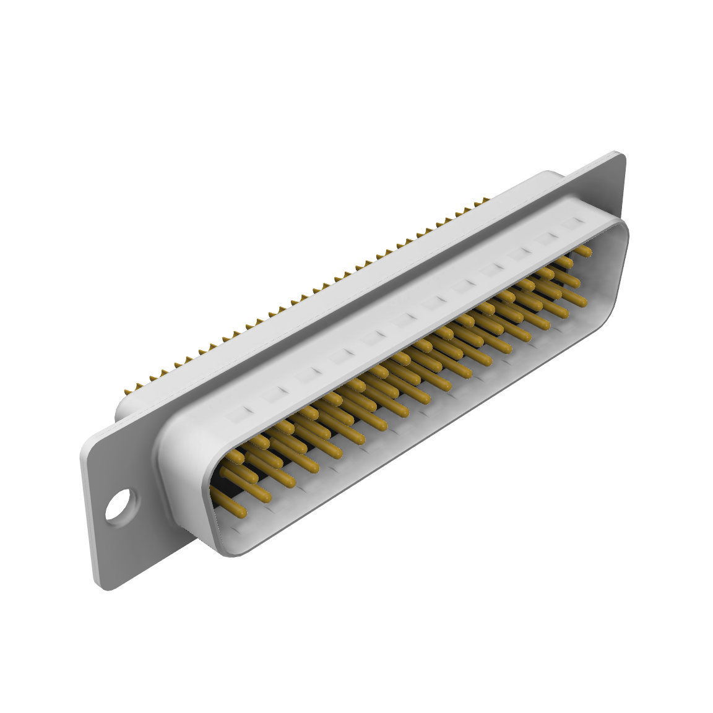

# Головний адаптер

!!! question ""
	Головний адаптер використовується як розгалужувач між тестером і конекторами кабеля, які він перевіряє.

### Список 3D-моделей (.stl)

|                  | Модель     | Кількість                     | Опис |
|------------------|------------|:-----------------------------:|------|
| {width=180}      | [CT_A_Bottom_Side.stl](main-adapter/models/CT_A_Bottom_Side.stl)           | 1 шт. | Основна частина корпусу, до неї прикручуються конектори і верхня кришка (`CT_A_Top_Side`)
| {width=180}         | [CT_A_Top_Side.stl](main-adapter/models/CT_A_Top_Side.stl)                 | 1 шт. | Кришка корпусу, до якої затискаються кабелі за допомогою `CT_A_Fixation_Bracket`.
| {width=180} | [CT_A_Fixation_Bracket.stl](main-adapter/models/CT_A_Fixation_Bracket.stl) | 2 шт. | Затискач для кабеля. 

### Список інших комплектуючих
|                                                 | Кількість | Опис |
|-------------------------------------------------|:---------:|------|
| {width=180} | 1 шт. | Конектор `D-Sub 50 (M)` (альтернативна назва `DB 50 Male`)
| {width=180} | 1 шт. | Конектор `D-Sub 50 (F)` (альтернативна назва `DB 50 Female`)
| {width=180} | 4 шт. | Гвинт M3x5 (Стандарту `DIN 912`)
| {width=180} | 8 шт. | Гвинт M3x10 (Стандарту `DIN 912`)

!!! warning ""
	Дана сторінка ще не дописана до кінця, коли вона буде повністю готова, то це повідомлення зникне.