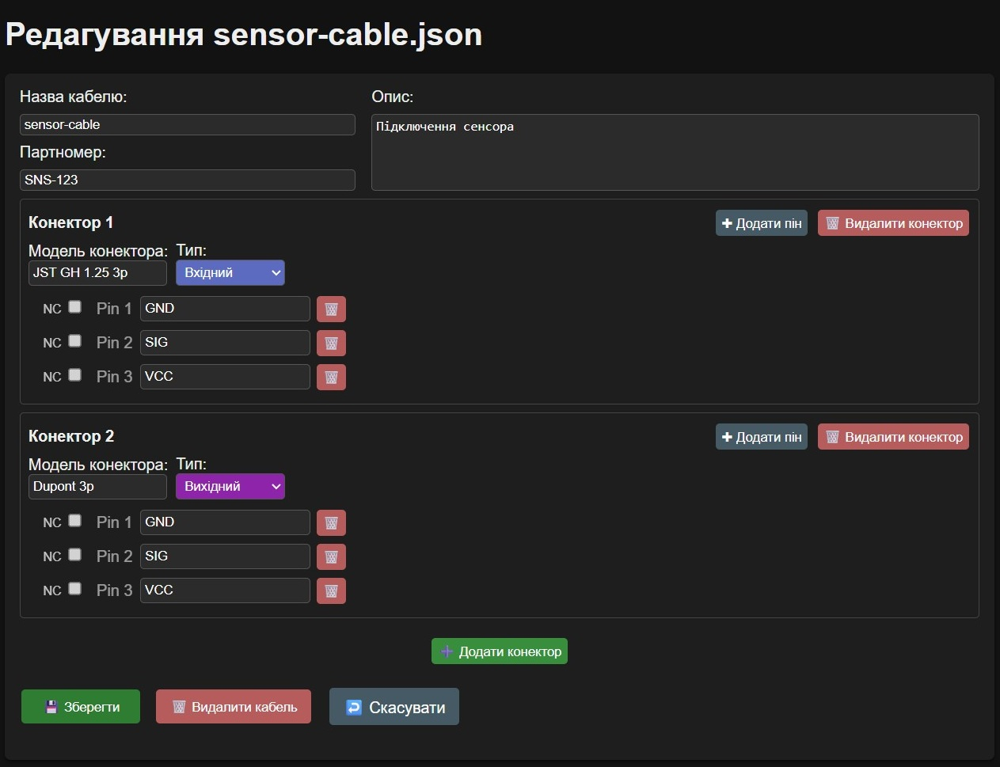
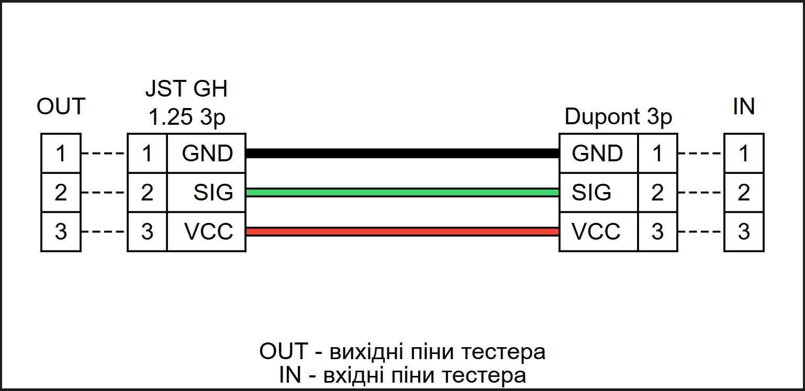
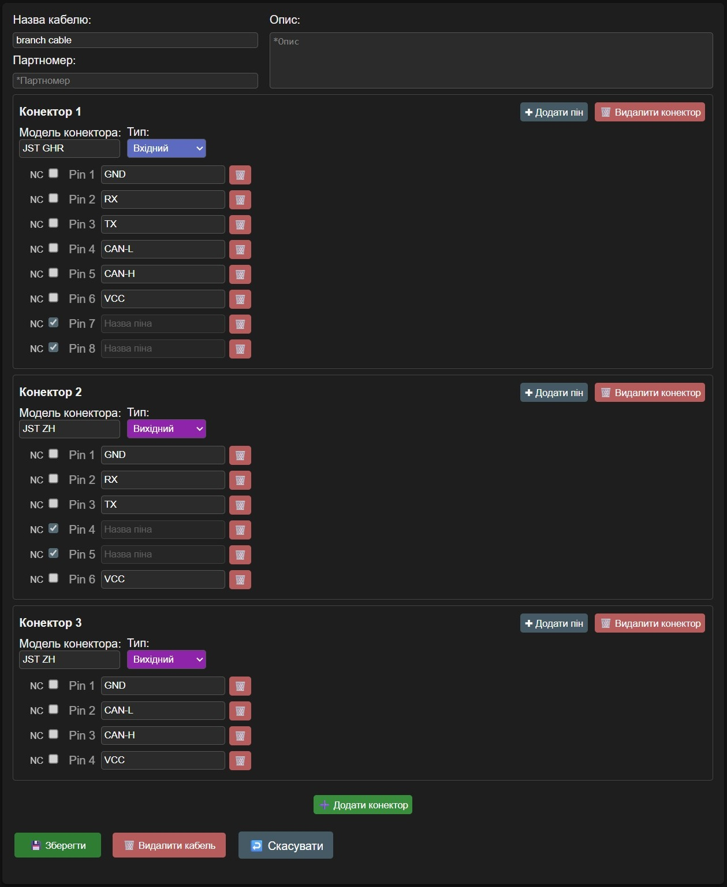
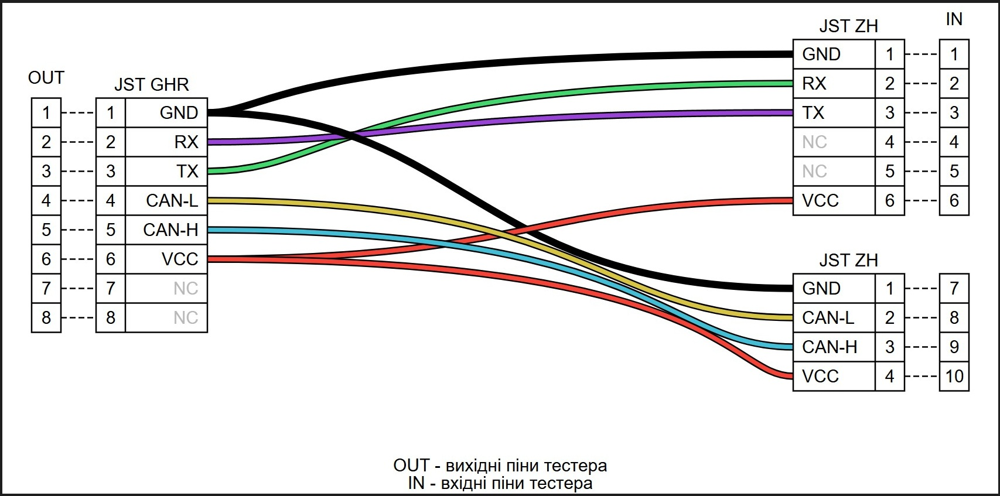

# Тест кабелю з пам’яті

Ви можете додавати, редагувати та у разі потреби перевіряти кабелі у постійній пам’яті тестера через веб-інтерфейс. 

## Структура файлів кабелів
У внутрішній пам’яті тестера кабелі зберігаються у вигляді файлів із розширенням `.json`. 
Безпосередньо працювати з форматом `.json` вам не доведеться, адже веб-інтерфейс має зручний графічний режим створення та редагування кабелів. 
Втім, я наведу приклади вмісту таких `.json`-файлів для загального розуміння логіки. 

Приклад простого кабелю: 
=== "Сторінка редагування ✏️"
    
=== "Згенерована тестером логіка з’єднань 🖼️"
    
=== "Вміст файлу 📤"
    ```json title="sensor-cable.json"
    {
      "description": "Підключення сенсора",
      "partnumber": "SNS-123",
      "connectors": [
        {
          "model": "JST GH 1.25 3p",
          "type": "in",
          "pins": [
            "GND",
            "SIG",
            "VCC"
          ]
        },
        {
          "model": "Dupont 3p",
          "type": "out",
          "pins": [
            "GND",
            "SIG",
            "VCC"
          ]
        }
      ]
    }
    ```

---

А ось трохи складніший кабель: 
=== "Сторінка редагування ✏️"
    
=== "Згенерована тестером логіка з’єднань 🖼️"
    
=== "Вміст файлу 📤"
    ```json title="branch cable.json"
    {
      "description": "",
      "partnumber": "",
      "connectors": [
        {
          "model": "JST GHR",
          "type": "in",
          "pins": [
            "GND",
            "RX",
            "TX",
            "CAN-L",
            "CAN-H",
            "VCC",
            {
              "unused": true,
              "label": ""
            },
            {
              "unused": true,
              "label": ""
            }
          ]
        },
        {
          "model": "JST ZH",
          "type": "out",
          "pins": [
            "GND",
            "RX",
            "TX",
            {
              "unused": true,
              "label": ""
            },
            {
              "unused": true,
              "label": ""
            },
            "VCC"
          ]
        },
        {
          "model": "JST ZH",
          "type": "out",
          "pins": [
            "GND",
            "CAN-L",
            "CAN-H",
            "VCC"
          ]
        }
      ]
    }
    ```

---

Як можна помітити, у файлах кабелів відсутні записи про те, який пін до якого під’єднано. 
Ці з’єднання тестер генерує автоматично. 

## Автогенерація з’єднань
Для логіки автогенерації не має значення, які саме назви ви вказуєте для кабелів, конекторів чи опису -
усі ці поля є лише довідковими для користувача. 

Алгоритм автогенерації з’єднань спирається на такі дані:

1. Тип конектора (`#!yaml Вхідний` / `#!yaml Вихідний`). 
2. Послідовність конекторів. 
3. Назви пінів. 
4. Стан прапорця `#!yaml NC` (*No Connect*) у пінах. 
5. Послідовність пінів у конекторі. 
6. Додаткові правила з’єднань (веб-сторінка `#!yaml Системні налаштування`). 

---

Алгоритм спочатку групує піни `#!yaml Вхідних`, а потім і `#!yaml Вихідних` конекторів. 

Далі він порівнює назви пінів між `#!yaml Вхідною` та `#!yaml Вихідною` групами. 
Якщо, наприклад, у вхідній групі є пін із назвою `GND`, і у вихідній групі теж є пін `GND`, 
це сприймається як з’єднання. 

При цьому регістр символів не має значення: для алгоритму `GND` і `gnd` — це одне й те саме. 
Відповідно, між ними створюється з’єднання. 

Щодо прапорця `#!yaml NC` (*No Connect*): якщо він увімкнений, то пін вважається неактивним.
Під час тесту перевіряється, щоб такий пін не мав жодних електричних з’єднань.

Наостанок алгоритм перевіряє перевизначення (`#!yaml Додаткові правила з’єднань`).
Це необхідно для випадків на кшталт з’єднань типу `RX -> TX` або `TX -> RX`, коли назви пінів не збігаються.
