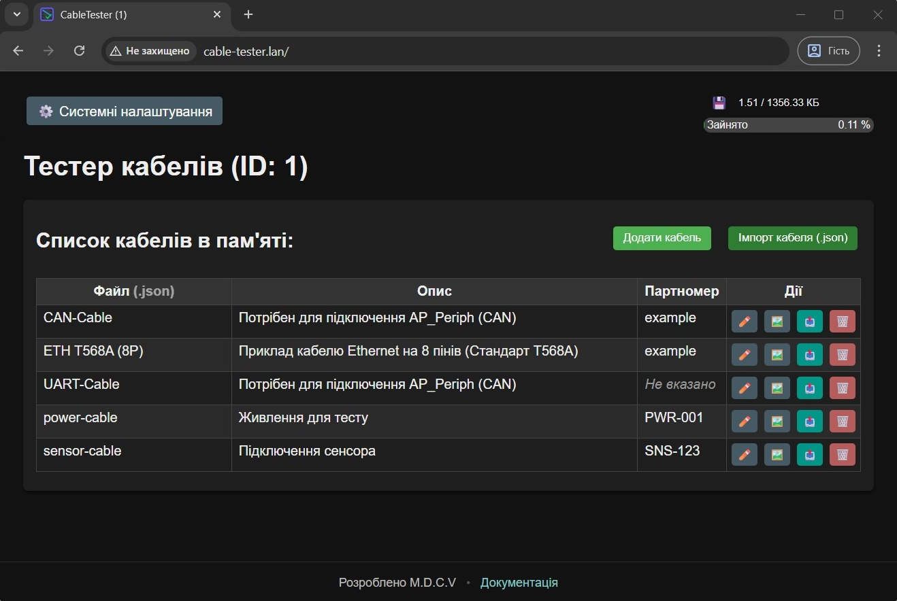
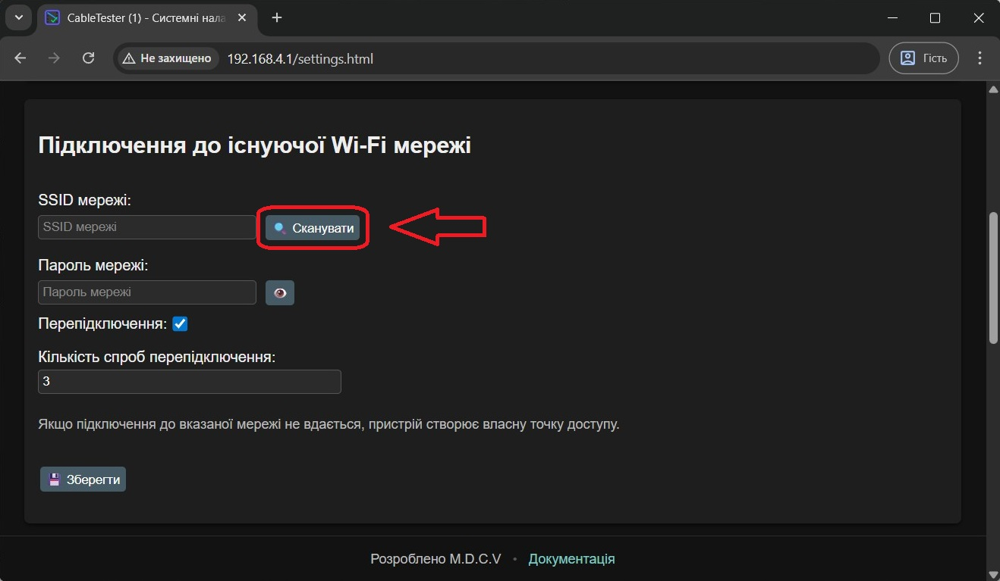
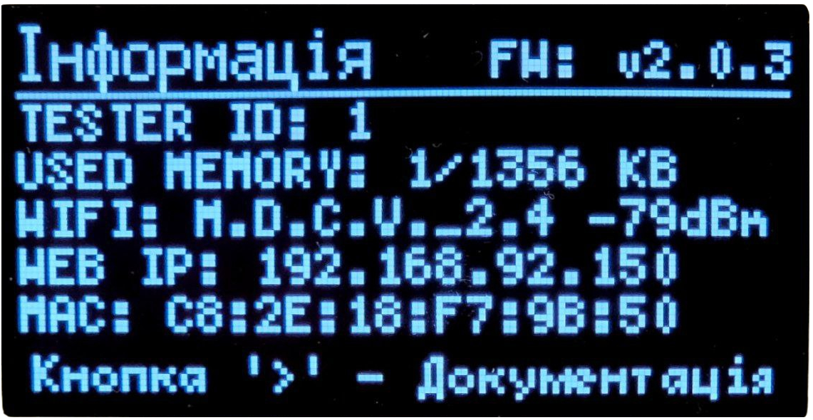

# Як потрапити у веб-інтерфейс

## Як підключитись до тестера
Підключення до тестера відбувається виключно безпроводним методом (*Wi-Fi 2.4 GHz*).
Він може працювати як в режимі роздавання власної точки доступу (*AP*), так і бути підключеним до вже існуючої мережі Wi-Fi.

За замовчуванням тестер роздає власну точку доступу Wi-Fi.

``` yaml title="Стандартна назва і пароль точки доступу Wi-Fi"
	Назва: CableTester-AP 
	Пароль: 12345678
```

Якщо ви підключаєтесь до цієї мережі з компютера (*windows*), то головна веб сторінка тестера відкриється автоматично. Те ж саме стосується більшості смартфонів.

??? question "Сайт тестера не відкрився автоматично, що робити?"
    Якщо ви підключились до мережі тестера з компютера, то ви можете в інтернет браузері вписати прямий IP:
    ``` cpp
		192.168.4.1
	```

	Якщо ви підключаєтесь з телефона, то зазвичай в сповіщеннях зявляється повідомлення про те що мережа без доступу до інтернета і потрібна авторизація, в більшості випадків коли натиснути на таке повідомлення то воно відкриє веб-інтерфейс тестера.



---
## Підключення тестера до існуючої мережі Wi-Fi
Тестер можна підєднати до вже існуючої мережі. Такий спосіб має свої плюси відносно роздавання точки доступу:

- Краще енергоефективність. Тестер буде менше витрачати заряд батареї.
- Залишається одночасний доступ як до інтернету, так і до тестера в межах локальної мережі.

---

Процес підключення до існуючої мережі:

1. Підключаємось до точки доступу тестера.
2. Переходимо на веб-інтерфейс (`#!yaml 192.168.4.1`)
3. На головній сторінці натискаємо на кнопку {.no-zoom width=200px}
4. Пролистуємо вниз сторінку системних налаштувань, поки не побачите блок `#!yaml Підключення до існуючої Wi-Fi мережі`.
5. <div class="grid" markdown>Ви можете вписати вручну назву вашої Wi-Fi мережі, або ж скористатись кнопкою сканування доступних мереж Wi-Fi. {width=100%}</div>
6. Введіть корректний пароль від Wi-Fi і натисніть кнопку збереження.

Після цих дій тестер підєднається до вказаної мережі і вимкне власну точку доступу. **Тепер тестер пріоритетно буде старатись підєднуватись до вказаної мережі**. Якщо мережа буде недоступною, то тестер автоматично запустить власну точку доступу.

Ви можете додатково активувати алгоритм `#!yaml Перепідключення` і вказати `#!yaml Кількість спроб перепідключення`. Для того щоб в разі обривів Wi-Fi, тестер намагався відновити з'єднання.

---

Після того як тестер підєднався до вашої Wi-Fi мережі, то ваш роутер більш за все встановить інший IP.
Для того щоб зрозуміти на який IP вам підключатись щоб потрапити на веб-інтерфейс тестера, ви можете скористатись вкладкою `#!py Інформація` на дисплеї тестера:
<div class="grid" markdown>


В моєму випадку, тестер отримав фактичний IP: `#!cpp 192.168.92.150`. Ймовірно у вас буде інший IP.
</div>

Тепер ви можете вводити даний IP і отримувати доступ до веб-інтерфейсу тестера.

